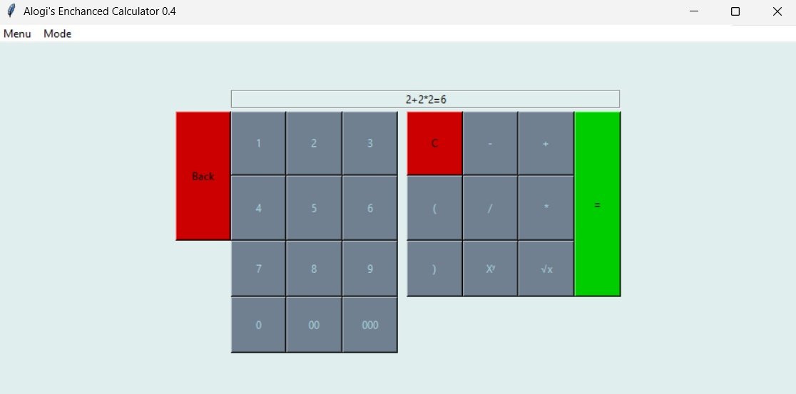
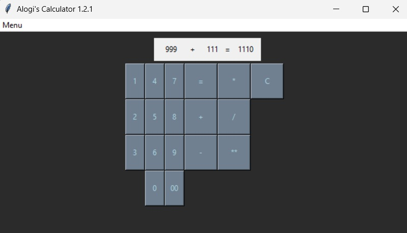
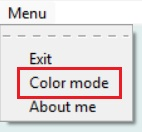

# Alogi's simple calculator.

  
  

> Launch of the Enhanced calculator project! For details, see the category "Enhanced calculator".

> My small attempt at creating an easy and simple calculator app with option for a virtual keyboard.

> NOTE: the app only calculates one operation (1+1 not 1+1+1)

## Backstory and motivations

The app was created as my first "major" app in python. I implemented my ideas one by one, to create a fun project mainly focusing on learning python in a fun way, instead of watching hours of tutorials.

## Features

- **Easy to understand almost "plug and play" UI:"** With the simplicity of tkinter, not only the UI is easy to use, but also the code is neatly organized and somewhat fast to understand for python beginers.
- **Almost all of the normal calculator options:** You can add, subtract, divide, multiply and exponentiate [roots will be added in near future versions!], but also you can change the brightness mode of the whole app.
- **Easy and fast access:** The app [as of 1.2.2] is lightweight alowing for quick start and usage. Only 11 KB!
- **Intuitive and simple screen:** The calculator has a quick and dynamic display alowing you to use this app in only one window.

## Tutorial

> TL;DR Just click the buttons!

### 1. Open the app and using the virtual keyboard type in the first number

### 2. Choose the action

### 3. Type in the 2nd number

### 4. Click the "=" button

### *Tip: Use the "C" button to clear the display*

## Screenshots

> Light mode

  

> Dark mode

  

> Menu; how to change the color mode

  

## Enhanced calculator

### I've started working on the new version aiming to allow for multiple operations in one go! You can see the newest version and the progress in the new branch.

# Enjoy the app!
