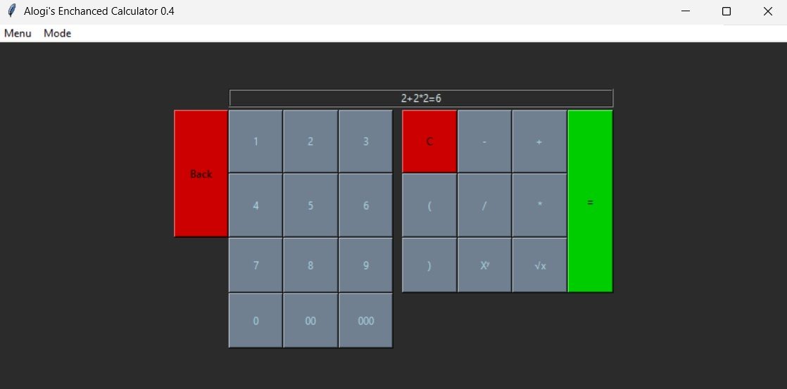

# Alogi's Enhanced Calculator

  
  

> Launch of the Enhanced Calculator project! For details, see the "Enhanced Calculator" section below.

> My attempt at creating a simple calculator app featuring an on-screen keyboard.

## Backstory and motivations

The app was created as my first "major" app in Python. I implemented my ideas one by one, to create a fun project mainly focusing on learning python in a fun way, instead of watching hours of tutorials.

## Features

- **Easy-to-Understand "Plug and Play" UI:** With the simplicity of Tkinter, not only is the UI easy to use, but the code is also neatly organized and easy for Python beginners to understand.
- **Standard & Advanced Features:** You can add, subtract, divide, multiply, calculate exponents, and find square roots. You can also calculate the area of triangles, rectangles, and trapezoids. Plus, you can switch between light and dark modes and resize the app window.
- **Easy and fast access:** The app [as of 1.2.2] is lightweight alowing for quick start and usage. Only 11 KB!
- **Intuitive and simple screen:** The calculator has a quick and dynamic display alowing you to use this app in only one window.

## Tutorial

> TL;DR Just click the buttons!

### Open the app and using the virtual keyboard type in your eqation and click the "=" button

### If you want to use different modes, head to the menus and click the "Mode" menu

  

### Select what figure you want to calculate

### Follow instructions on the display

### *Tip: Use the "C" button to clear the display and the "back" button as backspace*

## Screenshots

> Light mode

  

> Dark mode

  

> Menu; how to change the color mode

  

## Enhanced calculator

### I've started working on the new version aiming to allow for multiple operations in one go! You can see the newest version and the progress in the new branch.

### Completed features include:

- enhanced display
- better widgets look and colors
- widgets resizing
- multiple operations in one go
- square roots
- backspace button
- major code redesign
- modes for figure area calculations
- parentheses (bracket) buttons

### To be done:

- 

# Enjoy the app!
